# GoChinaAdvisors (仮) 代码架构与交互拓扑图

## 📋 项目概述

本文档详细记录了GoChinaAdvisors (仮)项目的代码结构、组件交互关系、依赖使用情况，以及每个页面和组件的技术实现细节。项目严格按照解决方案驱动、移动端优先、转化漏斗设计的核心哲学构建。

## 🏗️ 整体架构图

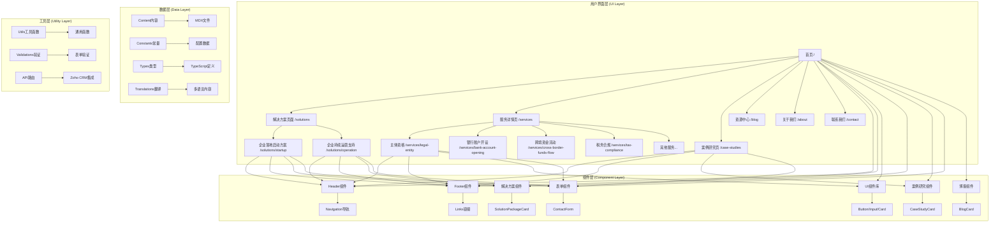

## 📁 详细代码结构

### 1. 页面结构 (Pages)

```
src/app/
├── layout.tsx                    # 根布局组件
├── page.tsx                      # 首页 (/)
├── globals.css                   # 全局样式
├── favicon.ico                   # 网站图标
├── (main)/                       # 主要路由组
│   ├── solutions/                # 解决方案页面
│   │   ├── startup/              # 企业落地启动方案
│   │   │   └── page.tsx          # /solutions/startup
│   │   └── operation/            # 企业持续运营支持
│   │       └── page.tsx          # /solutions/operation
│   ├── services/                 # 服务详情页面
│   │   ├── page.tsx              # 服务列表页 (/services)
│   │   ├── legal-entity/         # 主体资格
│   │   │   └── page.tsx          # /services/legal-entity
│   │   ├── bank-account-opening/ # 银行账户开设
│   │   │   └── page.tsx          # /services/bank-account-opening
│   │   ├── cross-border-funds-flow/ # 跨境资金流动
│   │   │   └── page.tsx          # /services/cross-border-funds-flow
│   │   ├── tax-compliance/       # 税务合规
│   │   │   └── page.tsx          # /services/tax-compliance
│   │   └── [service]/            # 动态服务路由
│   │       └── page.tsx          # /services/[service]
│   ├── case-studies/             # 案例研究页面
│   │   ├── page.tsx              # 案例列表页 (/case-studies)
│   │   └── [slug]/               # 动态案例路由
│   │       └── page.tsx          # /case-studies/[slug]
│   ├── blog/                     # 博客/资源中心
│   │   ├── page.tsx              # 博客列表页 (/blog)
│   │   ├── [slug]/               # 动态博客路由
│   │   │   └── page.tsx          # /blog/[slug]
│   │   └── category/             # 博客分类
│   │       └── [category]/       # 动态分类路由
│   │           └── page.tsx      # /blog/category/[category]
│   ├── about/                    # 关于我们
│   │   └── page.tsx              # 关于页面 (/about)
│   ├── contact/                  # 联系我们
│   │   └── page.tsx              # 联系页面 (/contact)
│   └── pricing/                  # 服务定价（规划中）
│       └── page.tsx              # 定价页面 (/pricing)
└── api/                          # API路由
    ├── contact/                  # 联系表单API
    │   └── route.ts              # POST /api/contact
    ├── subscribe/                # 邮件订阅API
    │   └── route.ts              # POST /api/subscribe
    └── blog/                     # 博客API
        └── route.ts              # GET /api/blog
```

### 2. 组件结构 (Components)

```
src/components/
├── ui/                           # 基础UI组件
│   ├── Button.tsx               # 按钮组件
│   ├── Input.tsx                # 输入框组件
│   ├── Card.tsx                 # 卡片组件
│   ├── Modal.tsx                # 模态框组件 (规划中)
│   ├── Toast.tsx                # 消息提示组件 (规划中)
│   ├── Loading.tsx               # 加载组件 (规划中)
│   └── __tests__/               # 组件测试
│       ├── Button.test.tsx      # 按钮组件测试
│       ├── Input.test.tsx       # 输入框组件测试
│       └── Card.test.tsx        # 卡片组件测试
├── layout/                       # 布局组件
│   ├── Header.tsx               # 头部导航组件
│   ├── Footer.tsx               # 页脚组件
│   ├── Navigation.tsx           # 主导航组件
│   └── Sidebar.tsx              # 侧边栏组件 (规划中)
├── solutions/                    # 解决方案组件
│   ├── SolutionPackageCard.tsx  # 解决方案包卡片组件
│   └── SolutionOverview.tsx     # 解决方案概览组件 (规划中)
├── case-studies/                 # 案例研究组件
│   ├── CaseStudyCard.tsx        # 案例研究卡片组件
│   ├── CaseStudyList.tsx        # 案例研究列表组件 (规划中)
│   └── CaseStudyDetail.tsx      # 案例研究详情组件 (规划中)
├── forms/                        # 表单组件
│   ├── ContactForm.tsx          # 联系表单组件
│   ├── NewsletterForm.tsx       # 邮件订阅表单 (规划中)
│   └── SearchForm.tsx           # 搜索表单组件 (规划中)
└── blog/                         # 博客组件
    ├── BlogCard.tsx             # 博客卡片组件 (规划中)
    ├── BlogList.tsx             # 博客列表组件 (规划中)
    ├── BlogDetail.tsx           # 博客详情组件 (规划中)
    ├── BlogSearch.tsx           # 博客搜索组件 (规划中)
    └── BlogPagination.tsx       # 博客分页组件 (规划中)
```

### 3. 工具和配置 (Utils & Config)

```
src/lib/
├── utils.ts                      # 通用工具函数
├── constants.ts                  # 常量配置
├── validations.ts                # 表单验证 (规划中)
├── api.ts                        # API调用函数 (规划中)
├── auth.ts                       # 认证相关 (规划中)
└── content.ts                    # 内容管理 (规划中)

src/types/
└── index.ts                      # TypeScript类型定义

content/                          # 内容管理
├── blog/                         # 博客文章
│   ├── china-foreign-investment-guide-2024.mdx
│   ├── wofe-vs-joint-venture-comparison.mdx
│   ├── china-bank-account-opening-guide.mdx
│   └── cross-border-funds-compliance.mdx
├── case-studies/                 # 成功案例
│   ├── german-tech-success.mdx
│   ├── us-manufacturing-china.mdx
│   └── uk-finance-license.mdx
└── translations/                 # 多语言翻译
    ├── zh/                       # 中文翻译
    │   ├── common.json           # 通用翻译
    │   ├── navigation.json       # 导航翻译
    │   └── forms.json            # 表单翻译
    └── en/                       # 英文翻译
        ├── common.json           # 通用翻译
        ├── navigation.json       # 导航翻译
        └── forms.json            # 表单翻译
```

## 🔄 组件交互拓扑图

### 1. 页面级交互

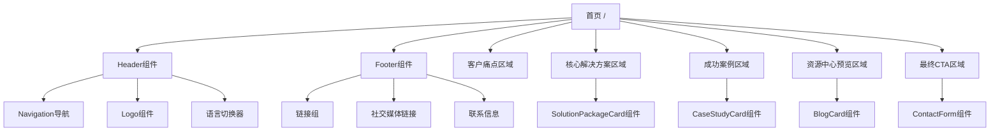

### 2. 组件级交互

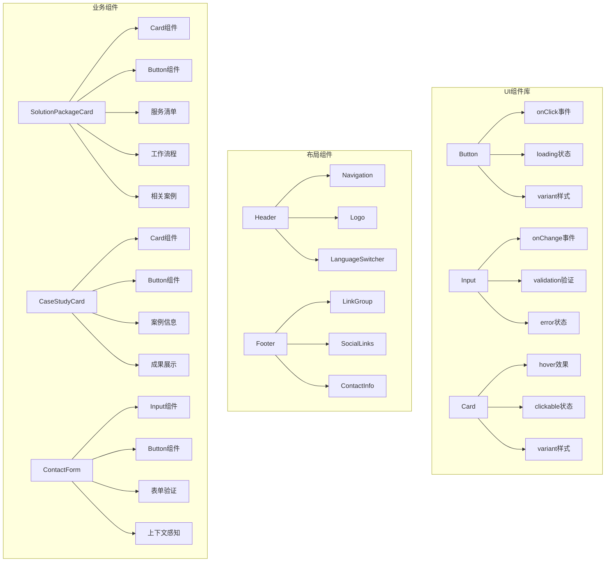

## 📊 数据流拓扑

### 1. 页面数据流

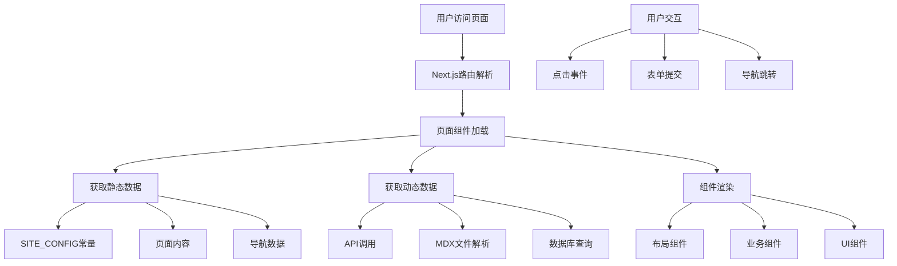

### 2. 组件数据流

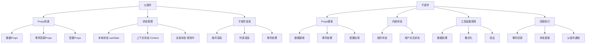

## 🎯 用户交互路径

### 1. 新用户访问路径

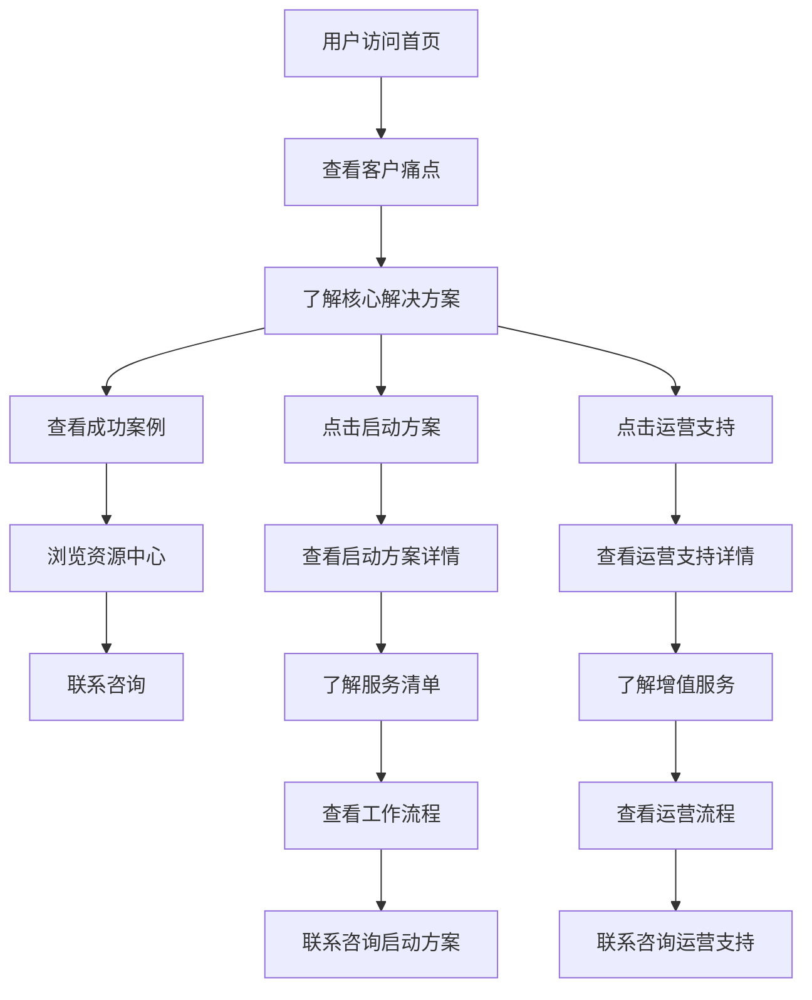

### 2. 现有用户访问路径

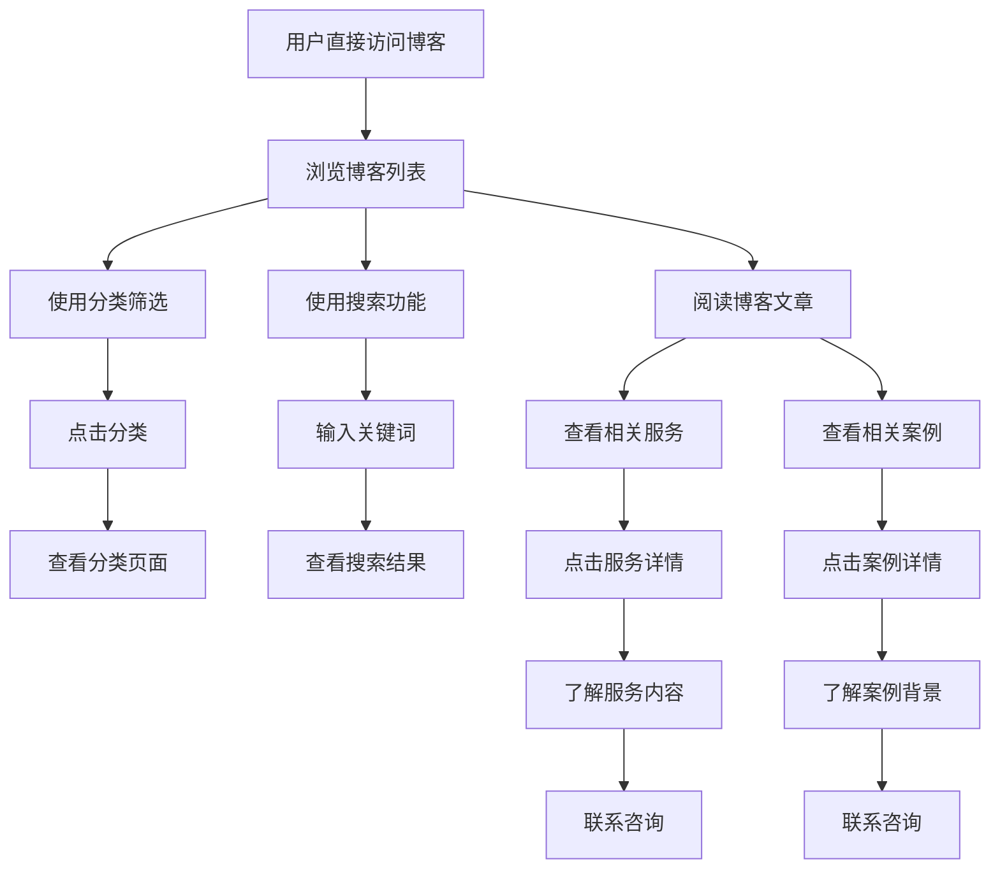

### 3. 服务咨询路径

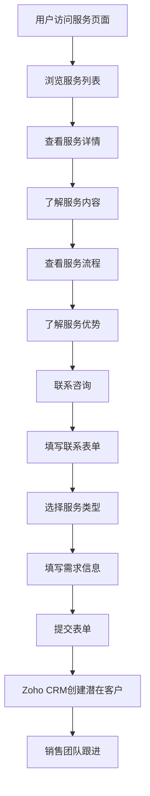

## 🔧 API交互拓扑

### 1. 现有API (规划中)

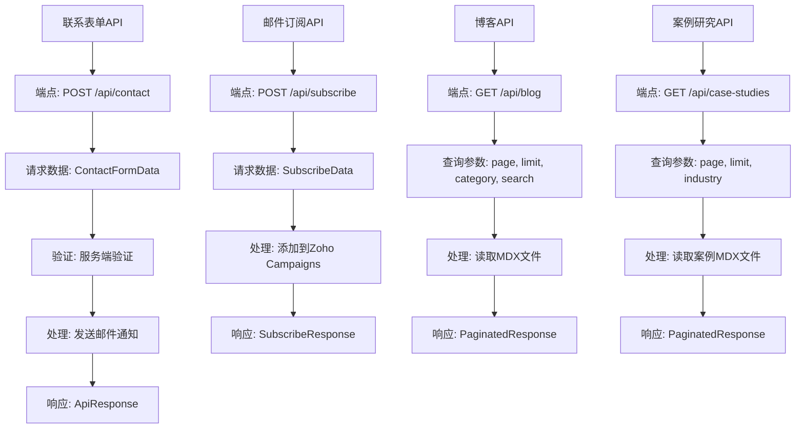

### 2. 外部服务交互 (规划中)

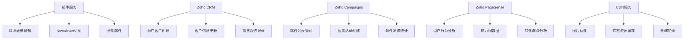

## 📱 响应式交互拓扑

### 1. 桌面端交互

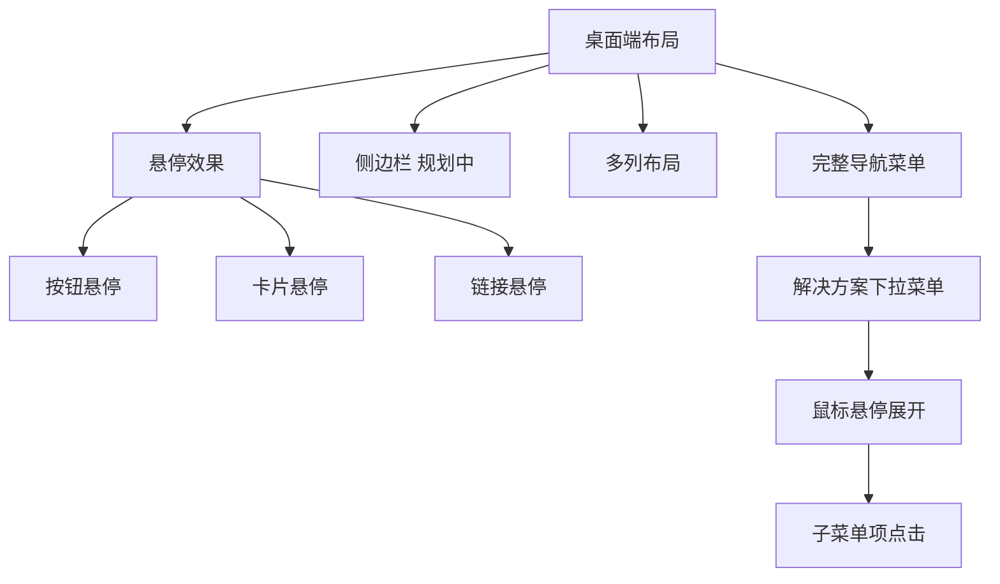

### 2. 移动端交互

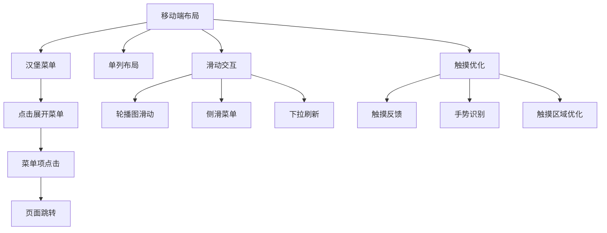

## 🚀 性能优化交互

### 1. 加载优化

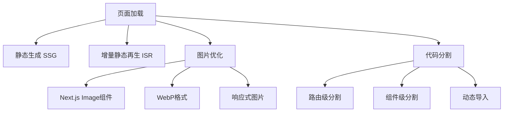

### 2. 交互优化

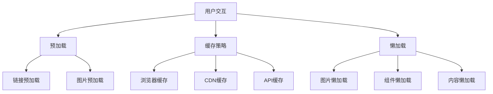

## 📋 开发检查清单

### 1. 新增组件时
- [ ] 创建组件文件
- [ ] 添加JSDoc注释
- [ ] 定义TypeScript接口
- [ ] 编写单元测试
- [ ] 更新Storybook (如适用)
- [ ] 记录依赖关系
- [ ] 确保移动端优先设计

### 2. 新增页面时
- [ ] 创建页面文件
- [ ] 添加SEO元数据
- [ ] 配置路由
- [ ] 添加布局组件
- [ ] 记录页面依赖
- [ ] 更新导航菜单
- [ ] 实施内容转化飞轮链接

### 3. 新增依赖时
- [ ] 评估依赖必要性
- [ ] 检查版本兼容性
- [ ] 更新package.json
- [ ] 记录使用位置
- [ ] 更新文档
- [ ] 运行安全审计

## 🔍 故障排除指南

### 1. 常见问题
- **组件不渲染**: 检查Props类型和默认值
- **样式不生效**: 检查Tailwind类名和cn函数
- **类型错误**: 检查TypeScript接口定义
- **测试失败**: 检查测试用例和组件实现
- **移动端显示异常**: 检查响应式设计和移动端优先原则

### 2. 调试工具
- **React DevTools**: 组件状态调试
- **Next.js DevTools**: 性能分析
- **TypeScript**: 类型检查
- **ESLint**: 代码质量检查
- **Chrome DevTools**: 移动端调试

---

**文档版本**: v2.0.0  
**最后更新**: 2024年1月  
**维护者**: 开发团队  
**项目**: GoChinaAdvisors (仮)