# Go China Advisors 代码架构与交互拓扑图

## 📋 项目概述

本文档详细记录了Go China Advisors项目的代码结构、组件交互关系、依赖使用情况，以及每个页面和组件的技术实现细节。项目严格按照解决方案驱动、移动端优先、转化漏斗设计的核心哲学构建。

## 🏗️ 整体架构图

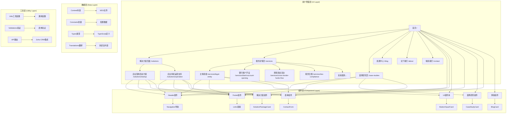

## 📁 最终确认的代码结构

### 清晰的网站代码结构

我们现在可以最终确认并固化我们的代码结构。这个结构完美地映射了我们所有的开发思想（原子设计、内容与代码分离等）。

```
/ (项目根目录)
├── 📁 00-DOCUMENTATION/          # 【项目指挥中心】存放所有高层级蓝图和规范文档 (00-14.md)
│
├── 📁 content/                   # 【内容仓库】存放所有非代码的、业务驱动的内容 (博客、案例、翻译JSON)
│
├── 📁 src/                       # 【源代码核心】
│   │
│   ├── 📁 app/                    # 【页面总装车间】
│   │   │                         # 存放所有页面的入口文件(page.tsx)和布局(layout.tsx)
│   │   │                         # 这里的文件应该很"薄"，主要负责组合组件和获取数据
│   │   └── ...
│   │
│   ├── 📁 components/             # 【高复用性零件库】
│   │   │                         # 存放所有可复用的UI组件，严格按照"原子设计"分层
│   │   ├── ui/                   # 原子 (Atoms) - Shadcn/ui 的基础零件
│   │   ├── molecules/            # 分子 (Molecules) - 我们自己组装的小功能单元
│   │   └── organisms/            # 组织 (Organisms) - 复杂的、独立的页面区域
│   │
│   ├── 📁 lib/                    # 【共享工具箱】
│   │   │                         # 存放全项目共享的工具函数(utils.ts)、常量(constants.ts)、
│   │   │                         # 以及与外部API(如Zoho)交互的逻辑(zoho.ts)
│   │
│   └── 📁 types/                  # 【类型定义字典】
│                                   # 存放所有共享的TypeScript类型定义
│
├── 📁 public/                     # 【静态资源库】存放图片、字体等无需编译的静态文件
│
├── 📁 .storybook/                 # 【组件实验室配置】Storybook的配置文件
│
└── 📄 package.json                # 【项目身份证与依赖清单】
```

### 1. 页面结构 (Pages) - 页面总装车间

```
src/app/
├── layout.tsx                    # 根布局组件
├── page.tsx                      # 首页 (/)
├── globals.css                   # 全局样式
├── favicon.ico                   # 网站图标
├── (main)/                       # 主要路由组
│   ├── solutions/                # 解决方案页面
│   │   ├── startup/              # 企业落地启动方案
│   │   │   └── page.tsx          # /solutions/startup
│   │   └── operation/            # 企业持续运营支持
│   │       └── page.tsx          # /solutions/operation
│   ├── services/                 # 服务详情页面
│   │   ├── page.tsx              # 服务列表页 (/services)
│   │   ├── legal-entity/         # 主体资格
│   │   │   └── page.tsx          # /services/legal-entity
│   │   ├── bank-account-opening/ # 银行账户开设
│   │   │   └── page.tsx          # /services/bank-account-opening
│   │   ├── cross-border-funds-flow/ # 跨境资金流动
│   │   │   └── page.tsx          # /services/cross-border-funds-flow
│   │   ├── tax-compliance/       # 税务合规
│   │   │   └── page.tsx          # /services/tax-compliance
│   │   ├── corporate-restructuring-and-exit/ # 企业重组与退出策略 (新增)
│   │   │   └── page.tsx          # /services/corporate-restructuring-and-exit
│   │   ├── equity-transfer/       # 股权转让服务 (新增)
│   │   │   └── page.tsx          # /services/equity-transfer
│   │   ├── asset-sale/           # 资产出售服务 (新增)
│   │   │   └── page.tsx          # /services/asset-sale
│   │   ├── liquidation-deregistration/ # 清算与注销服务 (新增)
│   │   │   └── page.tsx          # /services/liquidation-deregistration
│   │   ├── funds-liquidation-repatriation/ # 资金清算与汇出服务 (新增)
│   │   │   └── page.tsx          # /services/funds-liquidation-repatriation
│   │   ├── employee-severance-compensation/ # 员工遣散与补偿服务 (新增)
│   │   │   └── page.tsx          # /services/employee-severance-compensation
│   │   ├── alternative-strategy-consulting/ # 替代性方案咨询服务 (新增)
│   │   │   └── page.tsx          # /services/alternative-strategy-consulting
│   │   └── [service]/            # 动态服务路由
│   │       └── page.tsx          # /services/[service]
│   ├── case-studies/             # 案例研究页面
│   │   ├── page.tsx              # 案例列表页 (/case-studies)
│   │   ├── [slug]/               # 动态案例路由
│   │   │   └── page.tsx          # /case-studies/[slug]
│   │   └── tech-startup-success/ # 科技创业成功案例 (v4.2新增)
│   │       └── page.tsx          # /case-studies/tech-startup-success
│   ├── industries/               # 行业方案页面 (v4.2新增)
│   │   ├── page.tsx              # 行业概览页 (/industries)
│   │   ├── technology/            # 科技与软件行业
│   │   │   └── page.tsx          # /industries/technology
│   │   ├── e-commerce/           # 电子商务与零售
│   │   │   └── page.tsx          # /industries/e-commerce
│   │   ├── professional-services/ # 专业服务业
│   │   │   └── page.tsx          # /industries/professional-services
│   │   ├── advanced-manufacturing/ # 高端制造业
│   │   │   └── page.tsx          # /industries/advanced-manufacturing
│   │   └── medical-devices/      # 医疗器械
│   │       └── page.tsx          # /industries/medical-devices
│   ├── blog/                     # 博客/资源中心
│   │   ├── page.tsx              # 博客列表页 (/blog)
│   │   ├── [slug]/               # 动态博客路由
│   │   │   └── page.tsx          # /blog/[slug]
│   │   └── category/             # 博客分类
│   │       └── [category]/       # 动态分类路由
│   │           └── page.tsx      # /blog/category/[category]
│   ├── about/                    # 关于我们
│   │   └── page.tsx              # 关于页面 (/about)
│   ├── contact/                  # 联系我们
│   │   └── page.tsx              # 联系页面 (/contact)
│   └── pricing/                  # 服务定价（规划中）
│       └── page.tsx              # 定价页面 (/pricing)
└── api/                          # API路由
    ├── contact/                  # 联系表单API
    │   └── route.ts              # POST /api/contact
    ├── subscribe/                # 邮件订阅API
    │   └── route.ts              # POST /api/subscribe
    └── blog/                     # 博客API
        └── route.ts              # GET /api/blog
```

### 2. 组件结构 (Components) - 高复用性零件库

```
src/components/
├── ui/                           # 【原子层】Shadcn/ui 的基础零件
│   │                             # 这些组件是项目的"基础积木"，具有最高的复用性
│   ├── Button.tsx               # 按钮组件 - 支持多种变体和尺寸
│   ├── Input.tsx                # 输入框组件 - 统一的输入样式和交互
│   ├── Card.tsx                 # 卡片组件 - 内容容器的基础样式
│   ├── Badge.tsx                # 徽章组件 - 状态和标签显示
│   ├── Alert.tsx                # 警告组件 - 信息提示和警告
│   ├── Separator.tsx            # 分隔线组件 - 视觉分隔
│   ├── Select.tsx               # 选择器组件 - 下拉选择
│   ├── Checkbox.tsx             # 复选框组件 - 多选输入
│   ├── Textarea.tsx             # 文本域组件 - 多行文本输入
│   ├── Accordion.tsx            # 手风琴组件 - 折叠内容展示
│   ├── Avatar.tsx               # 头像组件 - 用户头像显示
│   ├── Dialog.tsx               # 对话框组件 - 模态弹窗
│   ├── DropdownMenu.tsx         # 下拉菜单组件 - 操作菜单
│   ├── NavigationMenu.tsx       # 导航菜单组件 - 复杂导航
│   ├── Table.tsx                # 表格组件 - 数据展示
│   ├── Tabs.tsx                 # 标签页组件 - 内容切换
│   ├── Toast.tsx                # 提示组件 - 临时消息
│   ├── Toaster.tsx              # 提示器组件 - 提示管理
│   ├── Tooltip.tsx              # 工具提示组件 - 悬停提示
│   └── __tests__/               # 组件测试
│       └── Button.test.tsx      # 按钮组件测试
│
├── molecules/                    # 【分子层】我们自己组装的小功能单元
│   │                             # 这些组件组合了多个原子组件，形成小的功能单元
│   ├── FormField.tsx            # 表单字段组件 - 标签+输入+验证的组合
│   ├── LabeledInput.tsx         # 带标签输入框 - 输入框的增强版本
│   └── SearchBox.tsx           # 搜索框组件 - 搜索功能的完整实现
│
├── organisms/                    # 【组织层】复杂的、独立的页面区域
│   │                             # 这些组件是页面的主要功能区域，具有完整的业务逻辑
│   ├── Header.tsx               # 头部组件 - 网站主导航和品牌
│   ├── Footer.tsx               # 页脚组件 - 网站底部信息和链接
│   ├── Navigation.tsx           # 导航组件 - 主导航逻辑
│   ├── MegaMenu.tsx             # 超级菜单组件 - 复杂下拉菜单
│   └── ContactForm.tsx          # 联系表单组件 - 完整的联系表单
│
├── business/                     # 【业务组件】特定业务逻辑的组件
│   │                             # 这些组件封装了特定的业务逻辑和展示
│   ├── SolutionPackageCard.tsx  # 解决方案包卡片 - 解决方案展示
│   ├── CorporateRestructuringCard.tsx  # 企业重组服务卡片 - 重组与退出服务展示
│   ├── ExitStrategyTimeline.tsx        # 退出策略时间线 - 退出流程时间线展示
│   ├── LegalComplianceChecklist.tsx    # 法律合规检查清单 - 合规要求检查
│   ├── CostCalculator.tsx              # 成本计算器 - 退出成本估算
│   └── RiskAssessmentMatrix.tsx        # 风险评估矩阵 - 风险识别和缓解
├── content/                      # 【内容组件】MDX内容专用组件 (新增)
│   │                             # 这些组件专门用于MDX内容中，提供丰富的内容表现力
│   ├── Alert.tsx                # 提示框组件 - 信息、警告、错误、成功提示
│   ├── Callout.tsx              # 突出显示组件 - 重要信息突出显示
│   ├── CodeBlock.tsx            # 代码块组件 - 支持语法高亮的代码展示
│   ├── Image.tsx                # 图片组件 - 优化的图片显示
│   ├── Video.tsx                # 视频组件 - 视频嵌入和播放
│   ├── Table.tsx                # 表格组件 - 数据表格展示
│   ├── Quote.tsx                # 引用组件 - 引用块和引用内容
│   ├── BlogCard.tsx             # 博客卡片 - 博客文章预览
│   ├── CaseStudyCard.tsx        # 案例研究卡片 - 成功案例展示
│   └── index.ts                 # 组件导出索引
│
├── layout/                       # 【布局组件】页面布局相关组件
│   │                             # 这些组件提供页面布局的基础结构
│   ├── Container.tsx            # 容器组件 - 内容宽度控制
│   ├── Grid.tsx                 # 网格组件 - 响应式网格布局
│   └── Stack.tsx                # 堆叠组件 - 垂直/水平堆叠布局
│
└── templates/                    # 【模板组件】页面模板组件
    │                             # 这些组件定义了完整页面的结构模板
    ├── BlogIndexTemplate.tsx    # 博客索引模板 - 博客列表页结构
    └── CaseStudyTemplate.tsx    # 案例研究模板 - 案例详情页结构
```

### 3. 共享工具箱 (Shared Tools) - lib目录

```
src/lib/                          # 【共享工具箱】
│                                 # 存放全项目共享的工具函数、常量、以及与外部API交互的逻辑
├── utils.ts                      # 通用工具函数 - clsx, cn等样式工具
├── constants.ts                  # 常量配置 - 网站配置、API端点等
├── validations.ts                # 表单验证 - Zod schema定义
├── api.ts                        # API调用函数 - Zoho CRM集成
├── auth.ts                       # 认证相关 - 用户认证逻辑
├── content-parser.ts             # 内容解析器 (新增) - MDX内容解析和处理
└── content.ts                    # 内容管理 - MDX文件处理

src/types/                        # 【类型定义字典】
│                                 # 存放所有共享的TypeScript类型定义
└── index.ts                      # TypeScript类型定义 - 全局类型接口
```

### 4. 内容仓库 (Content Repository)

```
content/                          # 【内容仓库】
│                                 # 存放所有非代码的、业务驱动的内容
├── blog/                         # 博客文章
│   ├── china-foreign-investment-guide-2024.mdx
│   ├── wofe-vs-joint-venture-comparison.mdx
│   ├── china-bank-account-opening-guide.mdx
│   └── cross-border-funds-compliance.mdx
├── case-studies/                 # 成功案例
│   ├── german-tech-success.mdx
│   ├── us-manufacturing-china.mdx
│   └── uk-finance-license.mdx
└── translations/                 # 多语言翻译
    ├── zh/                       # 中文翻译
    │   ├── common.json           # 通用翻译
    │   ├── navigation.json       # 导航翻译
    │   └── forms.json            # 表单翻译
    └── en/                       # 英文翻译
        ├── common.json           # 通用翻译
        ├── navigation.json       # 导航翻译
        └── forms.json            # 表单翻译
```

## 🔄 组件交互拓扑图

### 1. 页面级交互

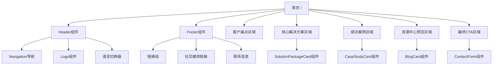

### 2. 组件级交互

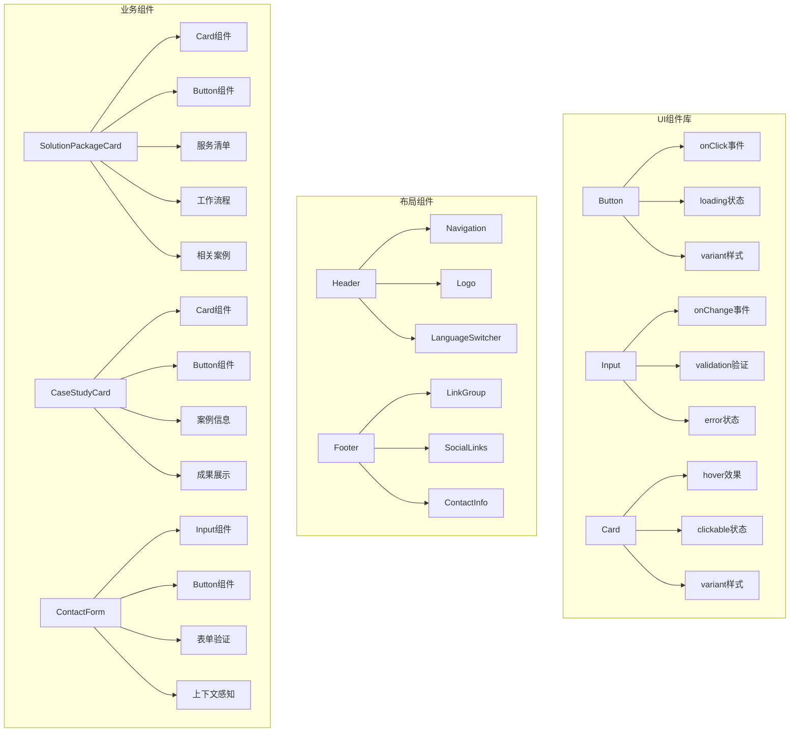

## 📊 数据流拓扑

### 1. 页面数据流

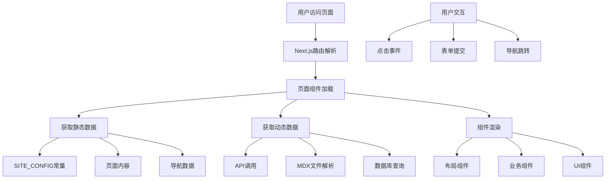

### 2. 组件数据流

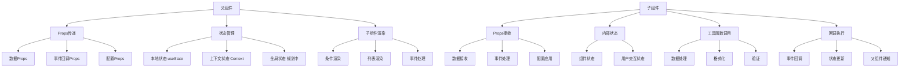

## 🎯 用户交互路径

### 1. 新用户访问路径

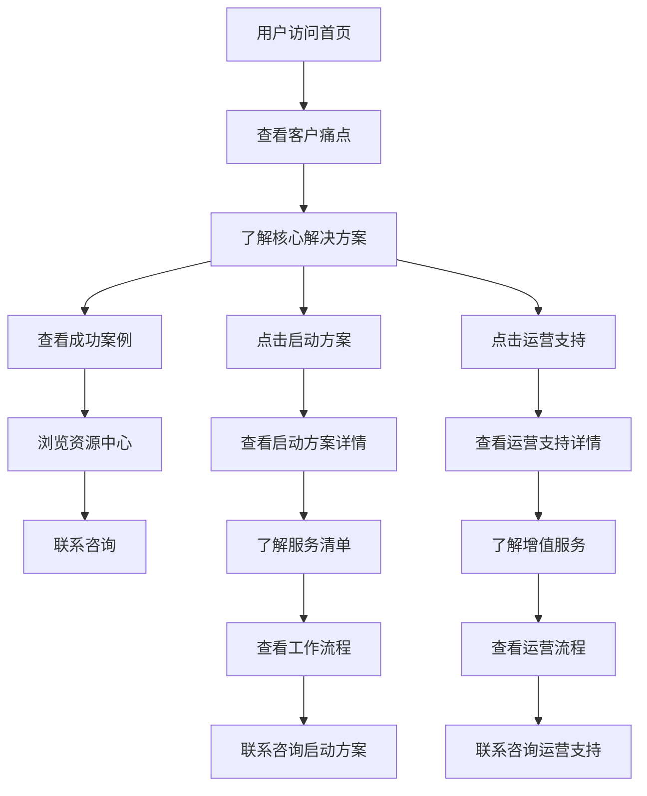

### 2. 现有用户访问路径

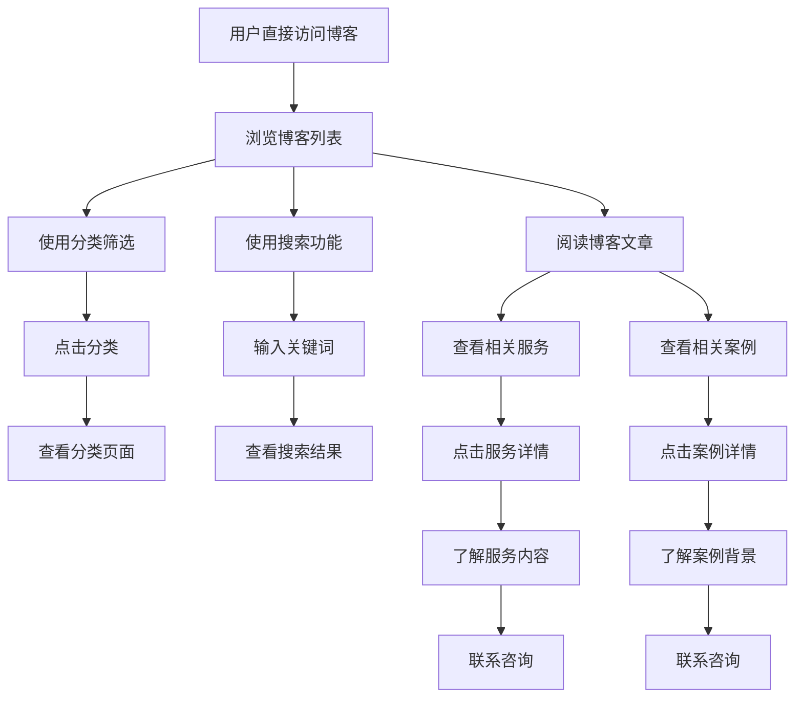

### 3. 服务咨询路径

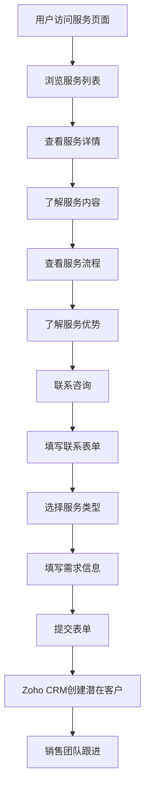

## 🔧 API交互拓扑

### 1. 现有API (规划中)

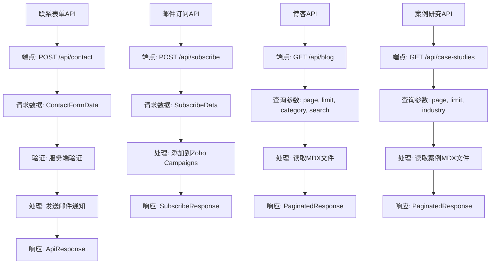

### 2. 外部服务交互 (规划中)

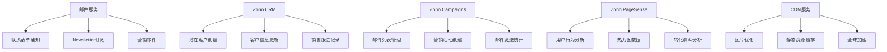

## 📱 响应式交互拓扑

### 1. 桌面端交互

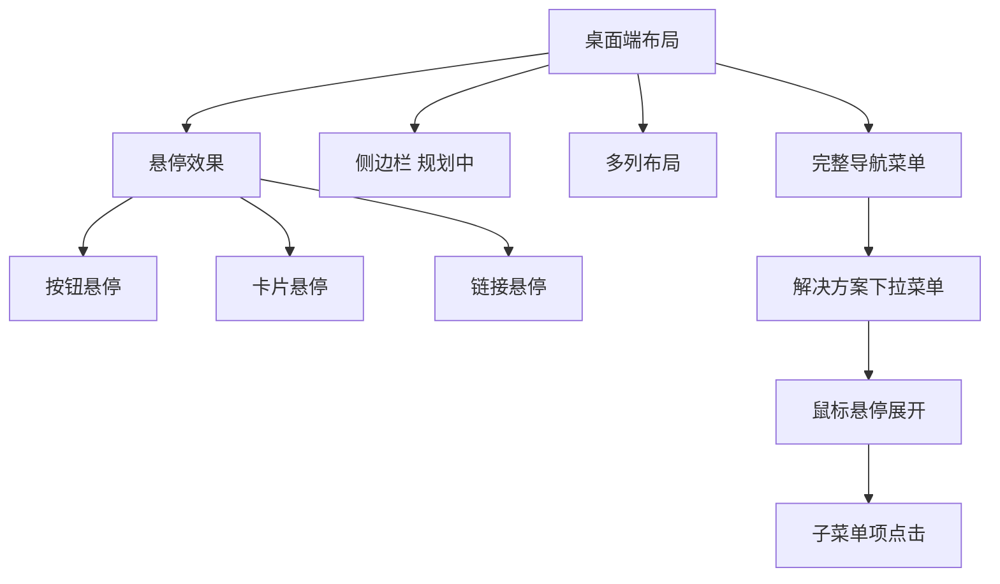

### 2. 移动端交互

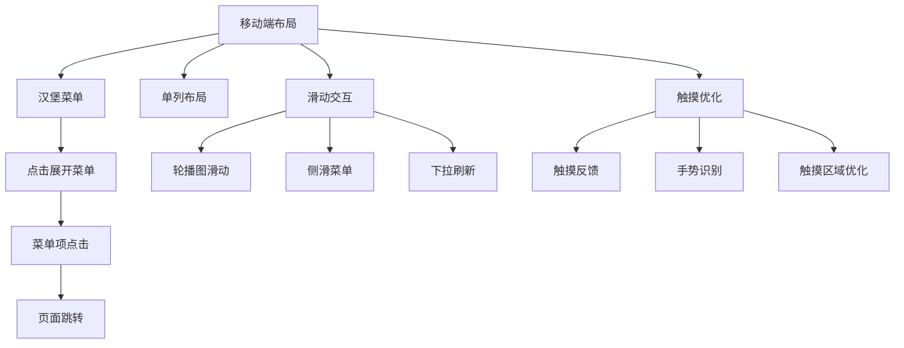

## 🚀 性能优化交互

### 1. 加载优化

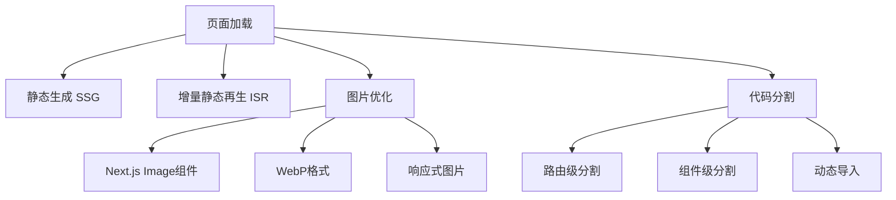

### 2. 交互优化

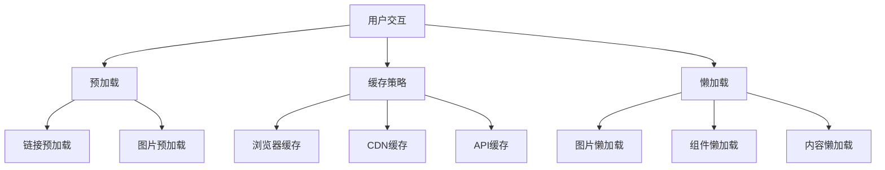

## 📋 开发检查清单

### 1. 新增组件时
- [ ] 创建组件文件
- [ ] 添加JSDoc注释
- [ ] 定义TypeScript接口
- [ ] 编写单元测试
- [ ] 更新Storybook (如适用)
- [ ] 记录依赖关系
- [ ] 确保移动端优先设计

### 2. 新增页面时
- [ ] 创建页面文件
- [ ] 添加SEO元数据
- [ ] 配置路由
- [ ] 添加布局组件
- [ ] 记录页面依赖
- [ ] 更新导航菜单
- [ ] 实施内容转化飞轮链接

### 3. 新增依赖时
- [ ] 评估依赖必要性
- [ ] 检查版本兼容性
- [ ] 更新package.json
- [ ] 记录使用位置
- [ ] 更新文档
- [ ] 运行安全审计

## 🔍 故障排除指南

### 1. 常见问题
- **组件不渲染**: 检查Props类型和默认值
- **样式不生效**: 检查Tailwind类名和cn函数
- **类型错误**: 检查TypeScript接口定义
- **测试失败**: 检查测试用例和组件实现
- **移动端显示异常**: 检查响应式设计和移动端优先原则

### 2. 调试工具
- **React DevTools**: 组件状态调试
- **Next.js DevTools**: 性能分析
- **TypeScript**: 类型检查
- **ESLint**: 代码质量检查
- **Chrome DevTools**: 移动端调试

---

## ⚠️ 重要提醒

### 代码结构的重要性
本文档定义的代码结构是项目的**核心基础**，所有开发工作都必须严格遵循：

1. **目录职责明确**: 每个目录都有其特定的职责和边界，不得随意跨越
2. **组件分层清晰**: 原子→分子→组织的分层必须严格遵守
3. **内容与代码分离**: `content/` 目录与 `src/` 目录的分离是项目架构的核心原则
4. **文档与代码共存**: JSDoc 注释是代码文档的主要形式，确保代码自我诠释

### 违反结构的后果
- 代码维护困难
- 团队协作混乱
- 项目扩展受阻
- 技术债务累积

**请在任何开发工作开始前，务必重新阅读本文档，确保理解并遵循所有结构原则。**

---

**重要提醒**: 本文档详细记录了项目的代码结构，但具体的页面规格、内容模块和交互逻辑请参考 **[14-页面规格与内容蓝图](./14-页面规格与内容蓝图.md)** - 项目的施工总蓝图和唯一事实来源。

**文档版本**: v2.0.0  
**最后更新**: 2024年1月  
**维护者**: 开发团队  
**项目**: Go China Advisors