# Go China Advisors 交互拓扑图

## 📋 概述

本文档详细描述了Go China Advisors网站的交互拓扑结构，包括页面间的导航关系、组件间的数据流、用户交互路径等。项目严格按照解决方案驱动、移动端优先、转化漏斗设计的核心哲学构建。

## 🗺️ 网站导航拓扑

### 1. 主要页面结构

```
首页 (/)
├── 解决方案页面 (/solutions)
│   ├── 企业落地启动方案 (/solutions/startup)
│   └── 企业持续运营支持 (/solutions/operation)
├── 服务详情页面 (/services)
│   ├── 主体资格 (/services/legal-entity)
│   ├── 银行账户开设 (/services/bank-account-opening)
│   ├── 跨境资金流动 (/services/cross-border-funds-flow)
│   ├── 税务合规 (/services/tax-compliance)
│   ├── 人员签证 (/services/hr-visa)
│   ├── 经营场所 (/services/premises-property)
│   ├── 行业准入 (/services/industry-licensing)
│   ├── 财税托管 (/services/financial-outsourcing)
│   ├── 知识产权 (/services/intellectual-property)
│   ├── 数字基建 (/services/digital-infrastructure)
│   └── 政策咨询 (/services/policy-subsidy)
├── 案例研究页面 (/case-studies)
│   ├── 案例列表页 (/case-studies)
│   ├── 案例详情页 (/case-studies/[slug])
│   └── 科技创业成功案例 (/case-studies/tech-startup-success) (v4.2新增)
├── 行业方案页面 (/industries) (v4.2新增)
│   ├── 行业概览页 (/industries)
│   ├── 科技与软件行业 (/industries/technology)
│   ├── 电子商务与零售 (/industries/e-commerce)
│   ├── 专业服务业 (/industries/professional-services)
│   ├── 高端制造业 (/industries/advanced-manufacturing)
│   └── 医疗器械 (/industries/medical-devices)
├── 资源中心 (/blog)
│   ├── 博客列表页 (/blog)
│   ├── 博客详情页 (/blog/[slug])
│   └── 分类页面 (/blog/category/[category])
├── 关于我们 (/about)
├── 联系我们 (/contact)
└── 服务定价 (/pricing) [规划中]
```

### 2. 页面间导航关系

```
首页
├── Header导航
│   ├── 解决方案超级菜单 (v4.2更新)
│   │   ├── 第一栏：按业务阶段划分
│   │   │   ├── 企业落地启动方案 → /solutions/startup
│   │   │   ├── 企业持续运营支持 → /solutions/operation
│   │   │   └── 全部服务概览 → /services
│   │   ├── 第二栏：按行业领域划分
│   │   │   ├── 科技与软件 (TMT) → /industries/technology
│   │   │   ├── 电子商务与零售 → /industries/e-commerce
│   │   │   ├── 专业服务业 → /industries/professional-services
│   │   │   ├── 高端制造业 → /industries/advanced-manufacturing
│   │   │   ├── 医疗器械 → /industries/medical-devices
│   │   │   └── 查看所有行业方案 → /industries
│   │   └── 第三栏：特色内容
│   │       ├── 🚀 科技创业成功案例 → /case-studies/tech-startup-success
│   │       └── 💬 获取免费咨询 → /contact
│   ├── 成功案例 → /case-studies
│   ├── 资源中心 → /blog
│   ├── 关于我们 → /about
│   └── 联系我们 → /contact
├── Hero区域CTA
│   ├── 咨询启动方案 → /solutions/startup
│   └── 获取运营支持 → /solutions/operation
├── 客户痛点区域
│   ├── 复杂注册流程 → /solutions/startup
│   ├── 税务合规难题 → /services/tax-compliance
│   ├── 跨境资金流动 → /services/cross-border-funds-flow
│   └── 人员签证问题 → /services/hr-visa
├── 核心解决方案区域
│   ├── 企业落地启动方案 → /solutions/startup
│   └── 企业持续运营支持 → /solutions/operation
├── 信任背书区域
│   └── 成功案例卡片 → /case-studies/[slug]
├── 资源中心预览区域
│   └── 博客文章卡片 → /blog/[slug]
└── 最终CTA区域
    └── 立即咨询 → /contact

解决方案页面
├── Header导航 (同首页)
├── SolutionPackageCard组件
│   ├── 服务清单链接 → /services/[service]
│   ├── 相关案例链接 → /case-studies/[slug]
│   └── 上下文联系表单 → /contact?subject=...
└── Footer (同首页)

服务详情页面
├── Header导航 (同首页)
├── 服务内容区域
│   ├── 关联内容链接 → /blog/[slug]
│   ├── 相关案例链接 → /case-studies/[slug]
│   └── 相关服务链接 → /services/[service]
├── FAQ区域
└── 上下文联系表单 → /contact?subject=...

案例研究页面
├── Header导航 (同首页)
├── CaseStudyCard组件
│   └── 查看完整案例 → /case-studies/[slug]
├── 相关案例推荐
└── Footer (同首页)

资源中心页面
├── Header导航 (同首页)
├── BlogCard组件
│   ├── 文章详情 → /blog/[slug]
│   ├── 分类筛选 → /blog/category/[category]
│   └── 相关服务链接 → /services/[service]
├── 搜索功能
└── Footer (同首页)
```

## 🔄 组件交互拓扑

### 1. 布局组件交互

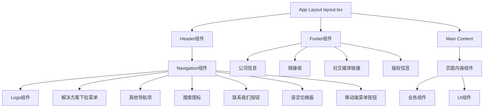

### 2. UI组件交互

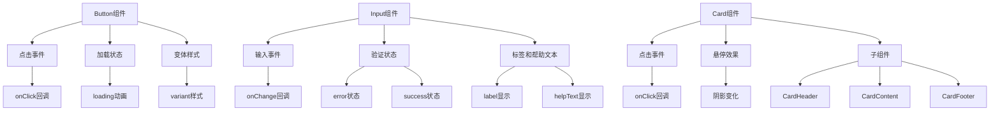

### 3. 业务组件交互

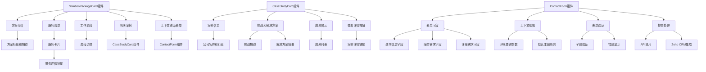

## 📊 数据流拓扑

### 1. 页面数据流

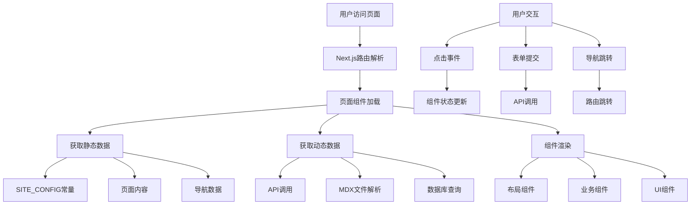

### 2. 组件数据流

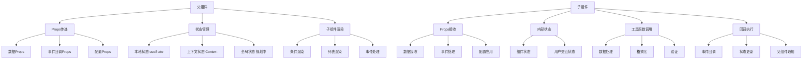

## 🎯 用户交互路径

### 1. 新用户访问路径

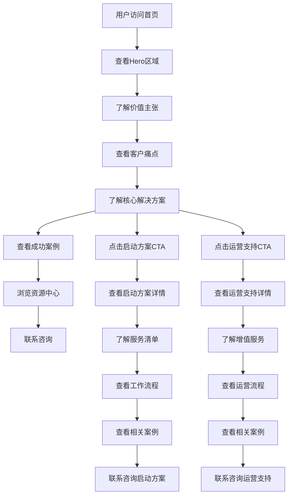

### 2. 现有用户访问路径

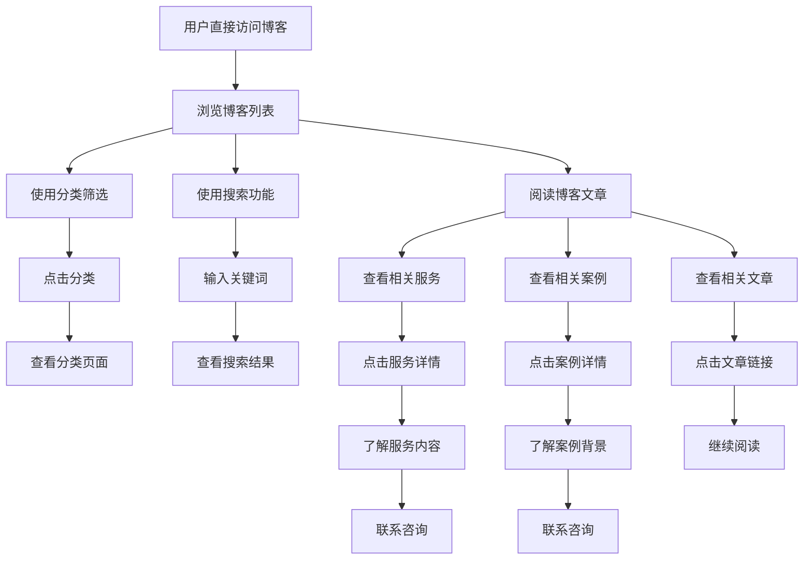

### 3. 服务咨询路径

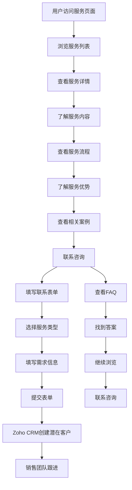

## 🔧 API交互拓扑

### 1. 现有API (规划中)

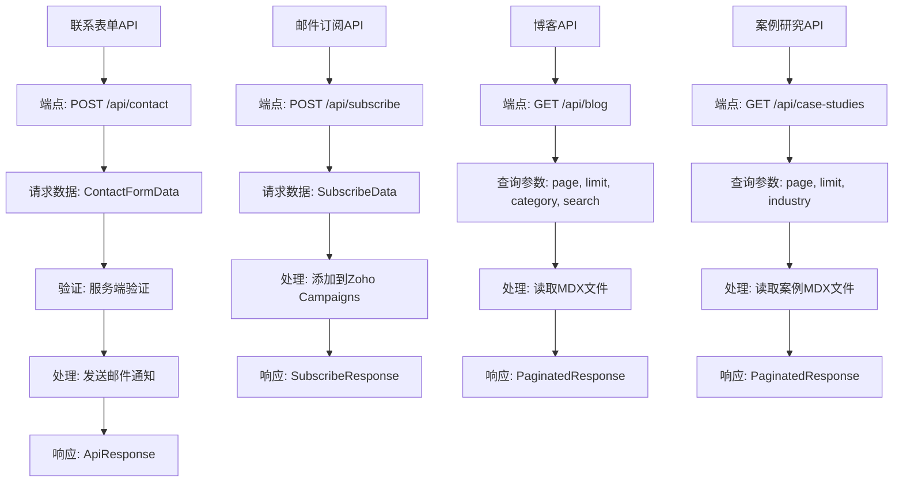

### 2. 外部服务交互 (规划中)

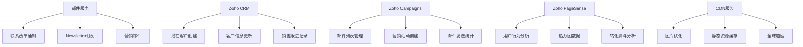

## 📱 响应式交互拓扑

### 1. 桌面端交互

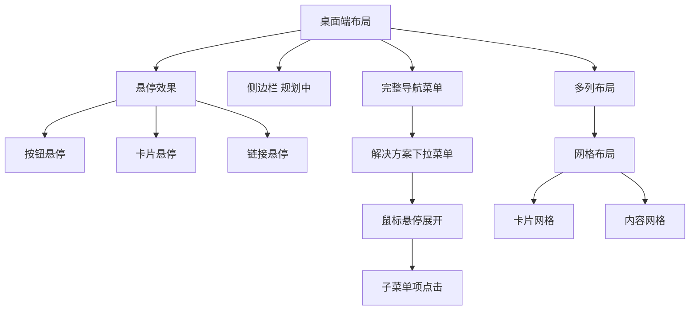

### 2. 移动端交互

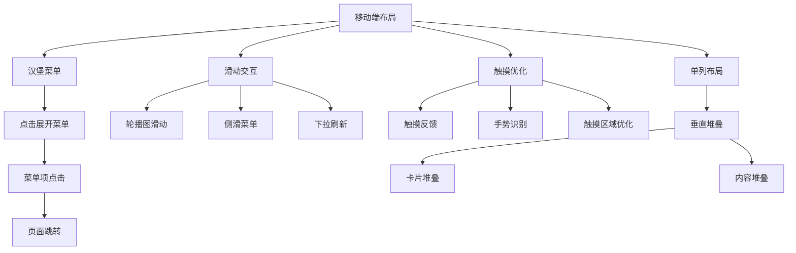

## 🚀 性能优化交互

### 1. 加载优化

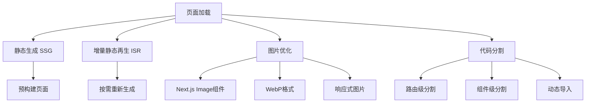

### 2. 交互优化

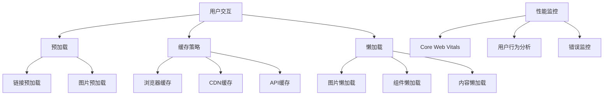

## 🔄 内容转化飞轮交互

### 1. 转化路径设计

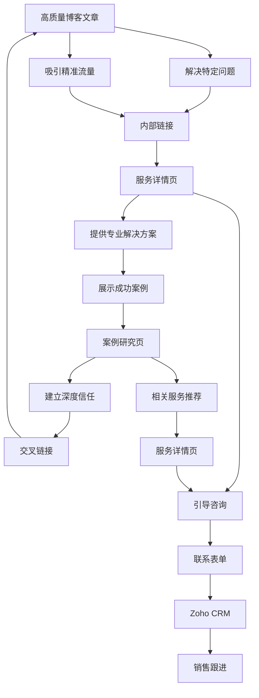

### 2. 有机链接策略

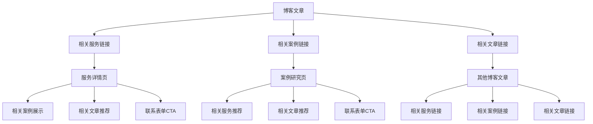

## 📋 开发检查清单

### 1. 新增组件时
- [ ] 创建组件文件
- [ ] 添加JSDoc注释
- [ ] 定义TypeScript接口
- [ ] 编写单元测试
- [ ] 更新Storybook (如适用)
- [ ] 记录依赖关系
- [ ] 确保移动端优先设计
- [ ] 实施内容转化飞轮链接

### 2. 新增页面时
- [ ] 创建页面文件
- [ ] 添加SEO元数据
- [ ] 配置路由
- [ ] 添加布局组件
- [ ] 记录页面依赖
- [ ] 更新导航菜单
- [ ] 实施内容转化飞轮链接
- [ ] 确保移动端优先设计

### 3. 新增依赖时
- [ ] 评估依赖必要性
- [ ] 检查版本兼容性
- [ ] 更新package.json
- [ ] 记录使用位置
- [ ] 更新文档
- [ ] 运行安全审计

## 🔍 故障排除指南

### 1. 常见问题
- **组件不渲染**: 检查Props类型和默认值
- **样式不生效**: 检查Tailwind类名和cn函数
- **类型错误**: 检查TypeScript接口定义
- **测试失败**: 检查测试用例和组件实现
- **移动端显示异常**: 检查响应式设计和移动端优先原则
- **转化路径断裂**: 检查内容转化飞轮链接

### 2. 调试工具
- **React DevTools**: 组件状态调试
- **Next.js DevTools**: 性能分析
- **TypeScript**: 类型检查
- **ESLint**: 代码质量检查
- **Chrome DevTools**: 移动端调试
- **Zoho PageSense**: 用户行为分析

---

**重要提醒**: 本文档详细描述了网站的交互拓扑结构，但具体的页面规格、内容模块和组件构成请参考 **[14-页面规格与内容蓝图](./14-页面规格与内容蓝图.md)** - 项目的施工总蓝图和唯一事实来源。

**文档版本**: v2.0.0  
**最后更新**: 2024年1月  
**维护者**: 开发团队  
**项目**: Go China Advisors