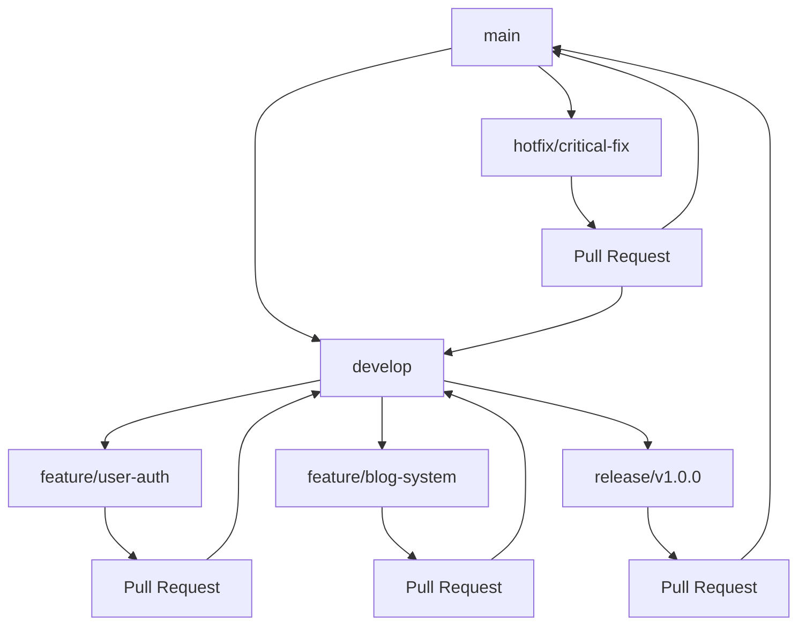

# Git 工作流文档

## 📋 当前Git管理状态

### 仓库信息
- **主分支**: `main`
- **当前分支**: `main`
- **远程仓库**: 暂无（本地仓库）
- **工作状态**: 干净，无待提交更改

### 提交历史
```
e075a66 docs: 添加架构优化总结文档
c9084a2 feat: 实施架构师优化建议
8770aac docs: 补充04-技术架构.md中的依赖库记录
58a37c0 docs: 添加项目完成总结文档
25b5704 feat: 完成基础组件和页面结构
e97a067 feat: 初始化项目基础架构
```

## 🚀 标准化Git工作流

### 分支策略

#### 主分支 (Main Branches)
- **`main`**: 生产环境分支，始终保持稳定可发布状态
- **`develop`**: 开发主分支，集成所有功能开发

#### 功能分支 (Feature Branches)
- **命名规范**: `feature/功能描述`
- **示例**: `feature/user-authentication`, `feature/blog-system`
- **来源**: 从 `develop` 分支创建
- **合并**: 通过 Pull Request 合并到 `develop`

#### 发布分支 (Release Branches)
- **命名规范**: `release/版本号`
- **示例**: `release/v1.0.0`, `release/v1.1.0`
- **用途**: 准备新版本发布，修复bug，更新版本号

#### 热修复分支 (Hotfix Branches)
- **命名规范**: `hotfix/问题描述`
- **示例**: `hotfix/critical-security-fix`
- **用途**: 紧急修复生产环境问题

### 分支管理流程图



## 📝 提交信息规范

### 建设过程记录的核心作用

**Git 提交信息是项目最详细、最精确的建设过程记录**。我们通过语义化提交信息来记录每一步的思考和工作，这比手动维护的文档更加准确和详细。

### Conventional Commits 规范

我们采用 [Conventional Commits](https://www.conventionalcommits.org/) 规范，格式如下：

```
<type>[optional scope]: <description>

[optional body]

[optional footer(s)]
```

### 提交类型 (Types)

| 类型 | 描述 | 示例 |
|------|------|------|
| `feat` | 新功能 | `feat: add user login functionality` |
| `fix` | 错误修复 | `fix: correct blog post sorting issue` |
| `docs` | 文档更新 | `docs: update architecture document` |
| `style` | 代码格式调整 | `style: format code with prettier` |
| `refactor` | 代码重构 | `refactor: extract common validation logic` |
| `test` | 测试相关 | `test: add unit tests for Button component` |
| `chore` | 构建过程或辅助工具变动 | `chore: update dependencies` |
| `perf` | 性能优化 | `perf: optimize image loading` |
| `ci` | CI/CD相关 | `ci: add GitHub Actions workflow` |

### 作用域 (Scope)

可选的作用域，用于指定更改的影响范围：

```
feat(auth): add OAuth2 login
fix(blog): correct post sorting
docs(api): update endpoint documentation
```

### 提交信息示例

#### 简单提交
```
feat: add user authentication system
fix: resolve navigation menu overflow issue
docs: update README with installation guide
```

#### 详细提交
```
feat(auth): add OAuth2 login functionality

- Implement Google OAuth2 integration
- Add user session management
- Create login/logout components
- Add authentication middleware

Closes #123
```

#### 破坏性更改
```
feat!: redesign user dashboard layout

BREAKING CHANGE: The dashboard layout has been completely redesigned.
Users will need to reconfigure their widget preferences.

- Remove old dashboard components
- Implement new responsive layout
- Add widget customization options
```

## 🔄 工作流程

### 1. 功能开发流程

```bash
# 1. 确保develop分支是最新的
git checkout develop
git pull origin develop

# 2. 创建功能分支
git checkout -b feature/user-authentication

# 3. 开发功能
# ... 编写代码 ...

# 4. 提交更改
git add .
git commit -m "feat(auth): add login form component"

# 5. 推送分支
git push origin feature/user-authentication

# 6. 创建Pull Request
# 在GitHub/GitLab上创建PR，从feature分支合并到develop
```

### 2. 代码审查流程

#### Pull Request 模板
```markdown
## 变更描述
简要描述此PR的变更内容

## 变更类型
- [ ] 新功能 (feat)
- [ ] 错误修复 (fix)
- [ ] 文档更新 (docs)
- [ ] 代码重构 (refactor)
- [ ] 测试相关 (test)
- [ ] 其他 (chore)

## 测试
- [ ] 单元测试通过
- [ ] 集成测试通过
- [ ] 手动测试完成

## 检查清单
- [ ] 代码遵循项目规范
- [ ] 添加了必要的文档
- [ ] 更新了相关文档
- [ ] 没有破坏性更改
```

#### 审查要点
1. **代码质量**: 遵循编码规范，无明显的代码异味
2. **功能完整性**: 功能按预期工作
3. **测试覆盖**: 有适当的测试覆盖
4. **文档更新**: 相关文档已更新
5. **性能影响**: 没有明显的性能回归

### 3. 发布流程

```bash
# 1. 创建发布分支
git checkout develop
git checkout -b release/v1.0.0

# 2. 更新版本号
# 更新package.json中的版本号
npm version 1.0.0

# 3. 修复发布相关的bug
# ... 修复bug ...

# 4. 合并到main分支
git checkout main
git merge release/v1.0.0

# 5. 创建标签
git tag -a v1.0.0 -m "Release version 1.0.0"

# 6. 合并回develop分支
git checkout develop
git merge release/v1.0.0

# 7. 删除发布分支
git branch -d release/v1.0.0
```

### 4. 热修复流程

```bash
# 1. 从main分支创建热修复分支
git checkout main
git checkout -b hotfix/critical-security-fix

# 2. 修复问题
# ... 修复代码 ...

# 3. 提交修复
git commit -m "fix(security): patch XSS vulnerability"

# 4. 合并到main分支
git checkout main
git merge hotfix/critical-security-fix

# 5. 创建标签
git tag -a v1.0.1 -m "Hotfix version 1.0.1"

# 6. 合并到develop分支
git checkout develop
git merge hotfix/critical-security-fix

# 7. 删除热修复分支
git branch -d hotfix/critical-security-fix
```

## 🛠️ Git 配置

### 推荐配置

```bash
# 设置用户信息
git config --global user.name "Your Name"
git config --global user.email "your.email@example.com"

# 设置默认分支名
git config --global init.defaultBranch main

# 设置推送策略
git config --global push.default simple

# 启用颜色输出
git config --global color.ui auto

# 设置别名
git config --global alias.st status
git config --global alias.co checkout
git config --global alias.br branch
git config --global alias.ci commit
git config --global alias.unstage 'reset HEAD --'
git config --global alias.last 'log -1 HEAD'
git config --global alias.visual '!gitk'
```

### .gitignore 配置

项目已配置完整的 `.gitignore` 文件，包括：
- Node.js 依赖 (`node_modules/`)
- 构建输出 (`.next/`, `out/`, `build/`)
- 环境变量文件 (`.env*.local`)
- IDE 配置文件 (`.vscode/`, `.idea/`)
- 操作系统文件 (`.DS_Store`, `Thumbs.db`)
- 日志文件 (`*.log`)

## 📊 分支保护规则

### main 分支保护
- 禁止直接推送
- 必须通过 Pull Request 合并
- 需要至少1个审查者批准
- 需要通过状态检查
- 需要分支是最新的

### develop 分支保护
- 禁止直接推送
- 必须通过 Pull Request 合并
- 需要至少1个审查者批准
- 需要通过状态检查

## 🔧 工具集成

### GitHub Actions (推荐)
```yaml
name: CI/CD Pipeline
on:
  push:
    branches: [main, develop]
  pull_request:
    branches: [main, develop]

jobs:
  test:
    runs-on: ubuntu-latest
    steps:
      - uses: actions/checkout@v3
      - uses: actions/setup-node@v3
        with:
          node-version: '18'
      - run: npm ci
      - run: npm run lint
      - run: npm run test
      - run: npm run build
```

### 自动化工具
- **Husky**: Git hooks 管理
- **lint-staged**: 提交前代码检查
- **commitizen**: 交互式提交信息生成
- **conventional-changelog**: 自动生成更新日志

## 📚 最佳实践

### 1. 提交频率与记录价值
- **频繁提交**：每个小的功能完成就提交
- **原子性提交**：每次提交只做一件事
- **清晰的提交信息**：描述做了什么，为什么做
- **建设过程记录**：每次提交都是项目发展历程的精确记录
- **自动化优势**：通过 Git 历史自动生成更新日志，无需手动维护

### 2. 分支管理
- 及时删除已合并的分支
- 保持分支名称简洁明了
- 定期同步主分支

### 3. 冲突解决
- 优先通过沟通避免冲突
- 冲突时优先选择保留双方更改
- 解决冲突后立即测试

### 4. 代码审查
- 审查者应该理解变更的上下文
- 提供建设性的反馈
- 及时响应审查请求

## 🚨 常见问题

### Q: 如何撤销最后一次提交？
```bash
# 保留更改，撤销提交
git reset --soft HEAD~1

# 完全撤销提交和更改
git reset --hard HEAD~1
```

### Q: 如何修改最后一次提交信息？
```bash
git commit --amend -m "新的提交信息"
```

### Q: 如何合并多个提交？
```bash
git rebase -i HEAD~3  # 合并最近3个提交
```

### Q: 如何从远程分支获取最新更改？
```bash
git fetch origin
git merge origin/main
```

---

**文档版本**: v1.0.0  
**最后更新**: 2025年1月  
**维护者**: 开发团队  
**项目**: Go China Advisors
