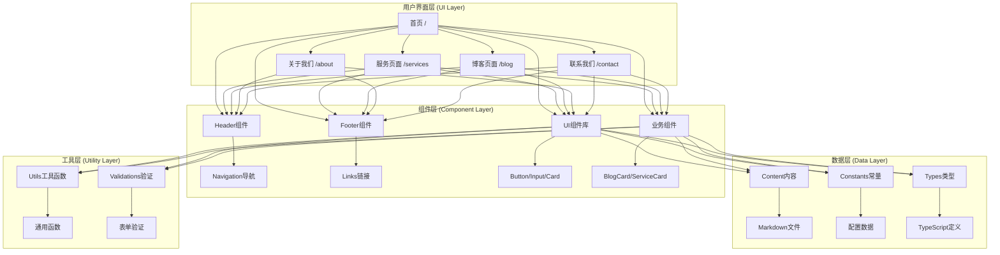
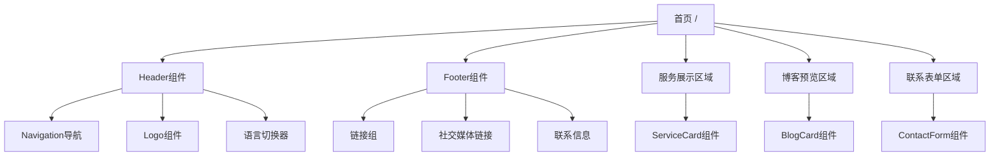
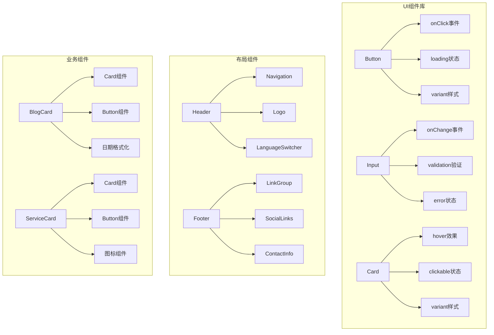
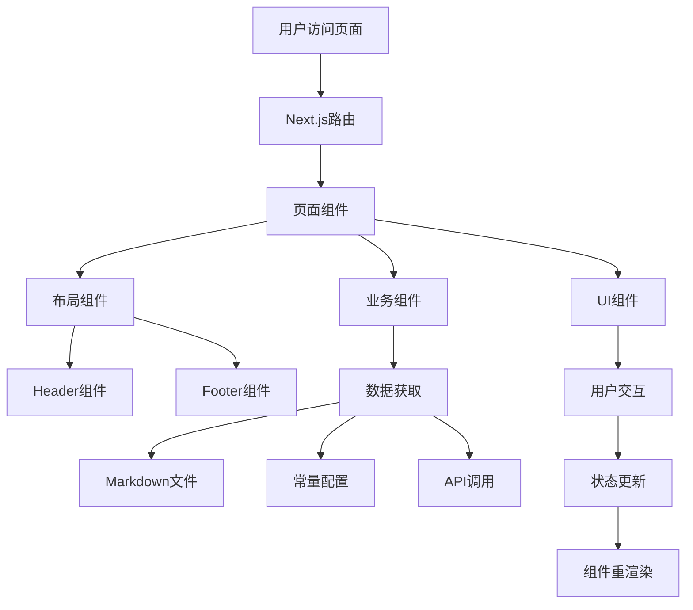
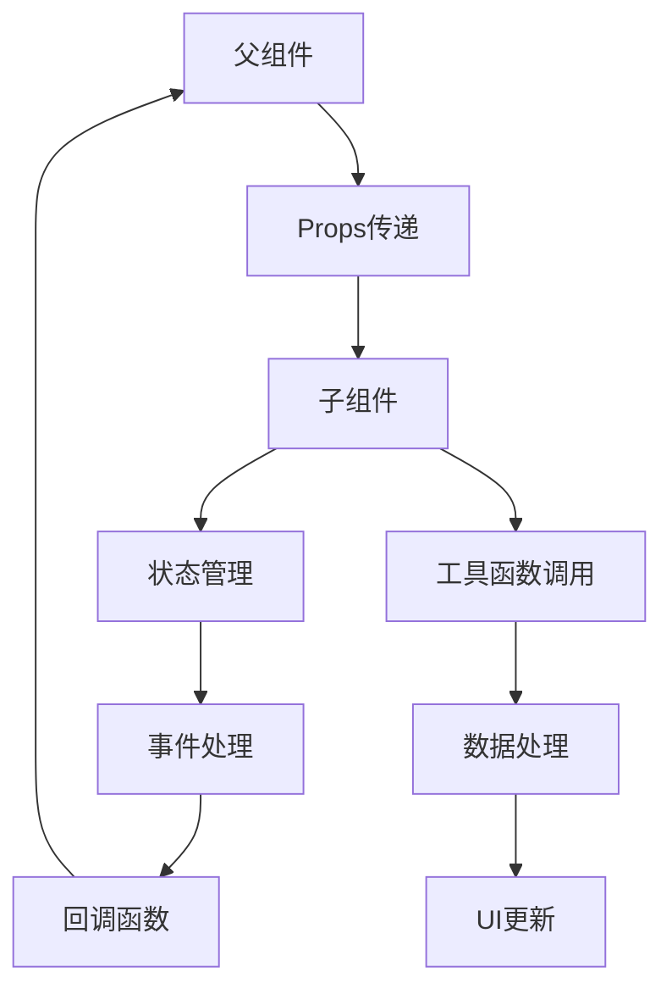

# 代码架构与交互拓扑图

## 📋 项目概述

本文档详细记录了网站的代码结构、组件交互关系、依赖使用情况，以及每个页面和组件的技术实现细节。

## 🏗️ 整体架构图



## 📁 详细代码结构

### 1. 页面结构 (Pages)

```
src/app/
├── layout.tsx                    # 根布局组件
├── page.tsx                      # 首页 (/)
├── globals.css                   # 全局样式
├── favicon.ico                   # 网站图标
├── (routes)/                     # 路由组 (规划中)
│   ├── blog/                     # 博客相关页面
│   │   ├── page.tsx             # 博客列表页 (/blog)
│   │   ├── [slug]/              # 动态路由
│   │   │   └── page.tsx         # 博客详情页 (/blog/[slug])
│   │   └── category/             # 分类页面
│   │       └── [category]/      # 动态分类路由
│   │           └── page.tsx     # 分类页面 (/blog/category/[category])
│   ├── services/                 # 服务页面
│   │   ├── page.tsx             # 服务列表页 (/services)
│   │   └── [service]/           # 动态服务路由
│   │       └── page.tsx         # 服务详情页 (/services/[service])
│   ├── about/                    # 关于我们
│   │   └── page.tsx             # 关于页面 (/about)
│   └── contact/                  # 联系我们
│       └── page.tsx             # 联系页面 (/contact)
└── api/                          # API路由 (规划中)
    ├── contact/                  # 联系表单API
    │   └── route.ts              # POST /api/contact
    └── blog/                     # 博客API
        └── route.ts              # GET /api/blog
```

### 2. 组件结构 (Components)

```
src/components/
├── ui/                           # 基础UI组件
│   ├── Button.tsx               # 按钮组件
│   ├── Input.tsx                # 输入框组件
│   ├── Card.tsx                 # 卡片组件
│   ├── Modal.tsx                # 模态框组件 (规划中)
│   ├── Toast.tsx                # 消息提示组件 (规划中)
│   ├── Loading.tsx               # 加载组件 (规划中)
│   └── __tests__/               # 组件测试
│       ├── Button.test.tsx      # 按钮组件测试
│       ├── Input.test.tsx       # 输入框组件测试
│       └── Card.test.tsx        # 卡片组件测试
├── layout/                       # 布局组件
│   ├── Header.tsx               # 头部导航组件
│   ├── Footer.tsx               # 页脚组件
│   ├── Navigation.tsx           # 导航组件 (规划中)
│   └── Sidebar.tsx              # 侧边栏组件 (规划中)
├── blog/                         # 博客相关组件
│   ├── BlogCard.tsx             # 博客卡片组件 (规划中)
│   ├── BlogList.tsx             # 博客列表组件 (规划中)
│   ├── BlogDetail.tsx           # 博客详情组件 (规划中)
│   ├── BlogSearch.tsx           # 博客搜索组件 (规划中)
│   └── BlogPagination.tsx       # 博客分页组件 (规划中)
├── forms/                        # 表单组件
│   ├── ContactForm.tsx          # 联系表单组件 (规划中)
│   ├── NewsletterForm.tsx       # 邮件订阅表单 (规划中)
│   └── SearchForm.tsx           # 搜索表单组件 (规划中)
└── business/                     # 业务组件
    ├── ServiceCard.tsx           # 服务卡片组件 (规划中)
    ├── TestimonialCard.tsx       # 客户评价卡片 (规划中)
    ├── PricingCard.tsx           # 价格卡片组件 (规划中)
    └── CaseStudyCard.tsx         # 案例研究卡片 (规划中)
```

### 3. 工具和配置 (Utils & Config)

```
src/lib/
├── utils.ts                      # 通用工具函数
├── constants.ts                  # 常量配置
├── validations.ts                # 表单验证 (规划中)
├── api.ts                        # API调用函数 (规划中)
├── auth.ts                       # 认证相关 (规划中)
└── content.ts                    # 内容管理 (规划中)

src/types/
└── index.ts                      # TypeScript类型定义

content/                          # 内容管理
├── blog/                         # 博客文章
│   ├── sample-post.md            # 示例文章
│   ├── company-registration.md   # 公司注册指南 (规划中)
│   └── bank-account.md          # 银行开户指南 (规划中)
├── pages/                        # 静态页面内容
│   ├── about.md                  # 关于我们内容 (规划中)
│   └── services.md               # 服务介绍内容 (规划中)
└── translations/                 # 多语言翻译
    ├── zh/                       # 中文翻译
    │   ├── common.json           # 通用翻译
    │   ├── navigation.json       # 导航翻译
    │   └── forms.json            # 表单翻译
    └── en/                       # 英文翻译
        ├── common.json           # 通用翻译
        ├── navigation.json       # 导航翻译
        └── forms.json            # 表单翻译
```

## 🔄 组件交互拓扑图

### 1. 页面级交互



### 2. 组件级交互



## 📦 依赖使用记录

### 1. 核心依赖 (Core Dependencies)

| 依赖包 | 版本 | 用途 | 使用位置 | 备注 |
|--------|------|------|----------|------|
| `next` | 15.5.3 | React框架 | 全项目 | 核心框架 |
| `react` | 19.1.0 | UI库 | 全项目 | 基础UI库 |
| `react-dom` | 19.1.0 | DOM渲染 | 全项目 | React DOM |
| `typescript` | ^5.9.2 | 类型系统 | 全项目 | 类型检查 |

### 2. 样式依赖 (Styling Dependencies)

| 依赖包 | 版本 | 用途 | 使用位置 | 备注 |
|--------|------|------|----------|------|
| `tailwindcss` | ^4 | CSS框架 | 全项目 | 样式系统 |
| `@tailwindcss/postcss` | ^4 | PostCSS插件 | 全项目 | CSS处理 |
| `clsx` | ^2.0.0 | 类名合并 | src/lib/utils.ts | 条件类名 |
| `tailwind-merge` | ^2.0.0 | 类名冲突解决 | src/lib/utils.ts | Tailwind优化 |

### 3. 内容管理依赖 (Content Dependencies)

| 依赖包 | 版本 | 用途 | 使用位置 | 备注 |
|--------|------|------|----------|------|
| `gray-matter` | ^4.0.3 | Frontmatter解析 | src/lib/content.ts | Markdown元数据 |
| `remark` | ^15.0.1 | Markdown处理 | src/lib/content.ts | Markdown解析 |
| `remark-html` | ^16.0.1 | HTML转换 | src/lib/content.ts | Markdown转HTML |

### 4. 国际化依赖 (i18n Dependencies)

| 依赖包 | 版本 | 用途 | 使用位置 | 备注 |
|--------|------|------|----------|------|
| `next-intl` | ^3.0.0 | 国际化 | 全项目 | 多语言支持 |

### 5. 开发依赖 (Development Dependencies)

| 依赖包 | 版本 | 用途 | 使用位置 | 备注 |
|--------|------|------|----------|------|
| `eslint` | ^9 | 代码检查 | 全项目 | 代码质量 |
| `eslint-config-next` | 15.5.3 | Next.js ESLint配置 | 全项目 | ESLint规则 |
| `eslint-plugin-jsx-a11y` | ^6.8.0 | 可访问性检查 | 全项目 | a11y规则 |
| `prettier` | ^3.0.0 | 代码格式化 | 全项目 | 代码风格 |
| `jest` | ^29.0.0 | 测试框架 | 全项目 | 单元测试 |
| `@testing-library/react` | ^14.0.0 | React测试工具 | src/components/__tests__ | 组件测试 |
| `@testing-library/jest-dom` | ^6.0.0 | Jest DOM匹配器 | jest.setup.js | 测试增强 |

## 🎯 组件依赖关系表

### 1. 页面组件依赖

| 页面 | 直接依赖组件 | 间接依赖组件 | 使用工具函数 | 使用常量 |
|------|-------------|-------------|-------------|----------|
| `/` (首页) | Header, Footer, Button, Card | Navigation, Logo, LinkGroup | cn, formatDate | SITE_CONFIG, SERVICE_TYPES |
| `/blog` | Header, Footer, BlogCard, BlogList | Navigation, Logo, LinkGroup | cn, slugify | SITE_CONFIG, BLOG_CATEGORIES |
| `/services` | Header, Footer, ServiceCard | Navigation, Logo, LinkGroup | cn | SITE_CONFIG, SERVICE_TYPES |
| `/about` | Header, Footer, Card | Navigation, Logo, LinkGroup | cn | SITE_CONFIG |
| `/contact` | Header, Footer, ContactForm | Navigation, Logo, LinkGroup | cn, isValidEmail, isValidPhone | SITE_CONFIG, VALIDATION_RULES |

### 2. UI组件依赖

| 组件 | 直接依赖 | 使用工具函数 | 使用常量 | 测试文件 |
|------|----------|-------------|----------|----------|
| Button | React.forwardRef | cn | - | Button.test.tsx |
| Input | React.forwardRef | cn | VALIDATION_RULES | Input.test.tsx (规划中) |
| Card | React.forwardRef | cn | - | Card.test.tsx (规划中) |
| Header | Button, Logo | cn | SITE_CONFIG | Header.test.tsx (规划中) |
| Footer | LinkGroup, SocialLinks | cn | SITE_CONFIG | Footer.test.tsx (规划中) |

### 3. 业务组件依赖 (规划中)

| 组件 | 直接依赖 | 使用工具函数 | 使用常量 | 测试文件 |
|------|----------|-------------|----------|----------|
| BlogCard | Card, Button | cn, formatDate, slugify | BLOG_CATEGORIES | BlogCard.test.tsx |
| ServiceCard | Card, Button | cn | SERVICE_TYPES | ServiceCard.test.tsx |
| ContactForm | Input, Button | cn, isValidEmail, isValidPhone | VALIDATION_RULES | ContactForm.test.tsx |

## 🔧 工具函数使用记录

### 1. 通用工具函数 (src/lib/utils.ts)

| 函数名 | 用途 | 使用位置 | 依赖包 |
|--------|------|----------|--------|
| `cn` | 类名合并 | 所有组件 | clsx, tailwind-merge |
| `formatDate` | 日期格式化 | BlogCard, 页面组件 | 原生API |
| `slugify` | URL slug生成 | BlogCard, 路由 | 原生API |
| `truncate` | 文本截断 | BlogCard, 摘要显示 | 原生API |
| `isValidEmail` | 邮箱验证 | ContactForm, 表单验证 | 原生API |
| `isValidPhone` | 手机号验证 | ContactForm, 表单验证 | 原生API |

### 2. 常量配置 (src/lib/constants.ts)

| 常量名 | 用途 | 使用位置 | 内容 |
|--------|------|----------|------|
| `SITE_CONFIG` | 网站配置 | 所有页面, Header, Footer | 网站基本信息 |
| `SERVICE_TYPES` | 服务类型 | 首页, 服务页面 | 服务分类 |
| `BLOG_CATEGORIES` | 博客分类 | 博客页面, BlogCard | 博客分类 |
| `SUPPORTED_LOCALES` | 支持语言 | 国际化组件 | 多语言配置 |
| `VALIDATION_RULES` | 验证规则 | 表单组件 | 表单验证规则 |

## 🚀 数据流图

### 1. 页面数据流



### 2. 组件数据流



## 📋 开发检查清单

### 1. 新增组件时
- [ ] 创建组件文件
- [ ] 添加JSDoc注释
- [ ] 定义TypeScript接口
- [ ] 编写单元测试
- [ ] 更新Storybook (如适用)
- [ ] 记录依赖关系

### 2. 新增页面时
- [ ] 创建页面文件
- [ ] 添加SEO元数据
- [ ] 配置路由
- [ ] 添加布局组件
- [ ] 记录页面依赖
- [ ] 更新导航菜单

### 3. 新增依赖时
- [ ] 评估依赖必要性
- [ ] 检查版本兼容性
- [ ] 更新package.json
- [ ] 记录使用位置
- [ ] 更新文档
- [ ] 运行安全审计

## 🔍 故障排除指南

### 1. 常见问题
- **组件不渲染**: 检查Props类型和默认值
- **样式不生效**: 检查Tailwind类名和cn函数
- **类型错误**: 检查TypeScript接口定义
- **测试失败**: 检查测试用例和组件实现

### 2. 调试工具
- **React DevTools**: 组件状态调试
- **Next.js DevTools**: 性能分析
- **TypeScript**: 类型检查
- **ESLint**: 代码质量检查

---

**文档版本**: v1.0.0  
**最后更新**: 2024年1月  
**维护者**: 开发团队
